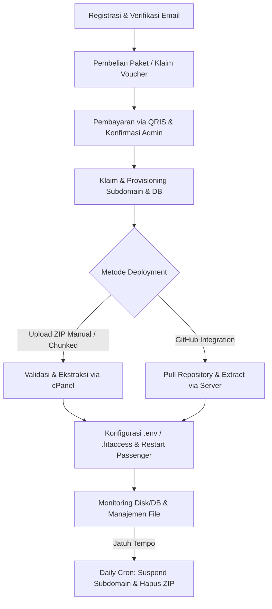
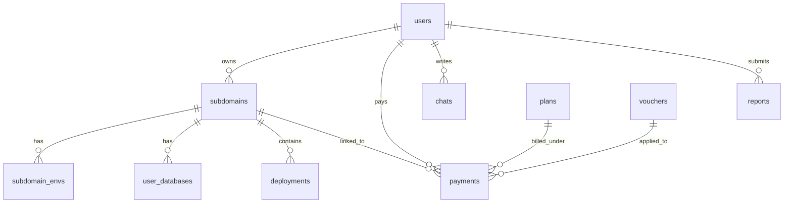
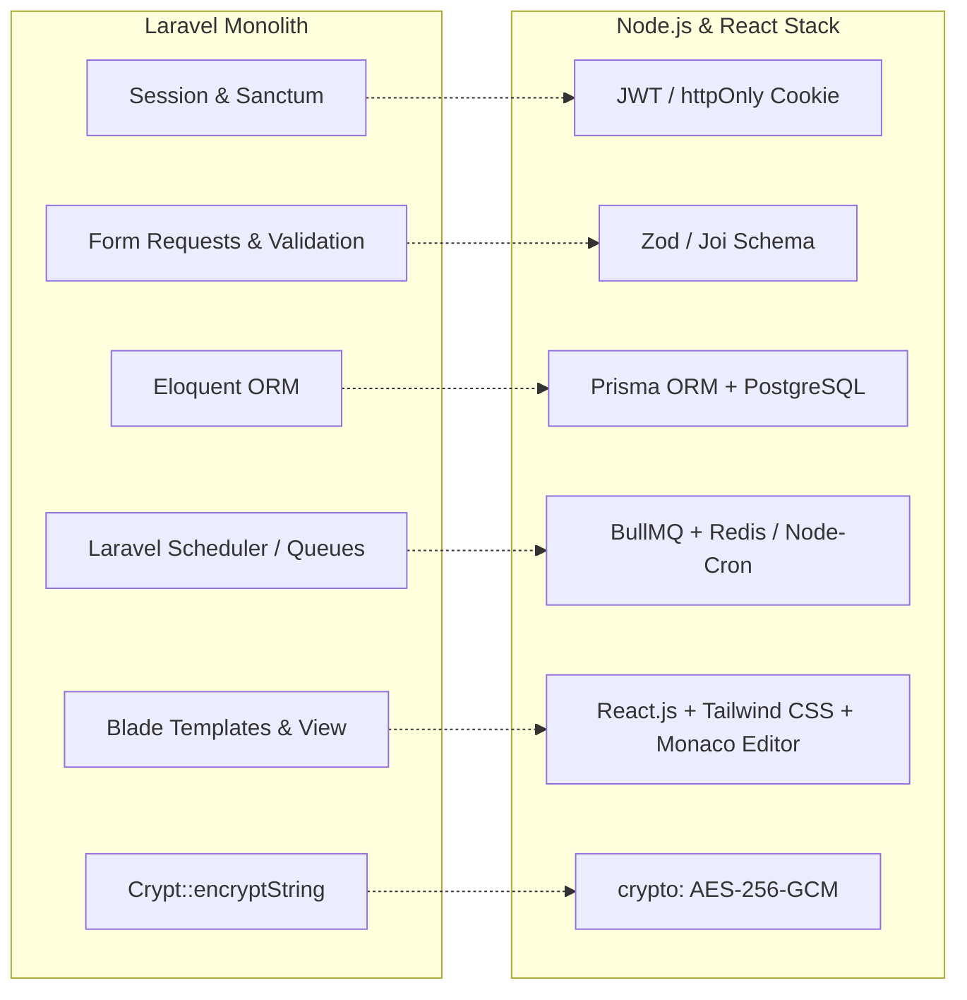

# REVERSE ENGINEERING & BLUEPRINT MIGRASI: SUBLY MANAGED HOSTING

Dokumen ini disusun sebagai basis pengetahuan teknis (Knowledge Base) mendalam untuk memandu AI Agent mandiri dalam melakukan migrasi sistem **Subly Managed Hosting** dari struktur monolith PHP (Laravel) ke Modern Decoupled Stack berbasis backend Node.js (TypeScript) dan frontend React.js.

---

## 1. IKHTISAR SISTEM & FLOW BISNIS

Subly Managed Hosting adalah platform otomatisasi Web Hosting yang mengintegrasikan panel kontrol (cPanel UAPI/API 2, CyberPanel, aaPanel, dan kustom Webhook) dengan manajemen siklus hidup aplikasi web client. Berdasarkan analisis kode sumber Laravel, sistem ini menyewakan slot subdomain hosting untuk menampung aplikasi berbasis **PHP**, **NodeJS**, **Laravel**, dan **Fullstack**.

### User Journey Utama



1. **Registrasi & Pelacakan Sesi**: User mendaftar melalui antarmuka standar auth Laravel. Setiap interaksi user dipantau oleh middleware `UserActivity` yang memperbarui timestamp field `last_seen_at` di tabel `users` secara real-time.
2. **Pembelian Paket & Voucher (Billing)**:
   - User memilih paket (`plans`). Di halaman checkout, user dapat memasukkan kode voucher (`vouchers`).
   - Sistem melakukan perhitungan harga akhir (mengurangi diskon tipe `fixed` atau `percent`). Jika total harga bernilai 0 (karena voucher gratis 100%), transaksi langsung sukses dan subdomain otomatis diperpanjang jika transaksi tersebut berupa pembaruan (`renew`).
   - Jika harga > 0, sistem menerapkan logika kode unik 3 digit terakhir (`unique_code`). Uniknya, sistem menyimpan cache kode unik sebelumnya milik user tersebut di database untuk menghindari user mencari kode unik yang lebih kecil ("fishing code").
   - Transaksi disimpan dengan status `pending`, dan notifikasi dikirimkan ke email administrator melalui mailable `AdminPaymentNotification`.
   - Admin memverifikasi pembayaran secara manual melalui dashboard. Ketika admin mengonfirmasi pembayaran, status transaksi berubah menjadi `success`, masa aktif subdomain (`expired_at`) diperpanjang sesuai dengan durasi bulan paket, dan notifikasi pesan otomatis dikirim ke client via entri baru di tabel `chats`.
3. **Klaim & Provisioning Subdomain**:
   - Setelah pembayaran sukses, user mendapatkan slot kosong subdomain. User memasukkan nama subdomain (maksimum 63 karakter, alphanumeric dengan pemisah dash/underscore).
   - Backend memicu `ServerProvisioningService` untuk membuat subdomain di cPanel/hosting panel, membuat MySQL database dan MySQL user (jika user tersebut belum memiliki database sebelumnya, sistem akan membuat user baru; jika sudah ada, sistem menggunakan kembali MySQL user lama untuk meminimalkan beban pembuatan user di hosting panel), mengasosiasikan user ke database dengan hak akses `ALL PRIVILEGES`, dan membuat file landing page `index.html` default.
4. **Alur Deployment**:
   - **Upload ZIP (Manual)**: Untuk file berukuran kecil, ZIP langsung dikirim ke `DeploymentController@store`. Untuk file berukuran besar, frontend membagi file menjadi beberapa bagian (chunk) dan dikirim ke API `uploadChunk`. Potongan file disimpan di folder `storage/app/chunks/{upload_id}` lalu disatukan kembali setelah lengkap. ZIP divalidasi (ukuran file, struktur internal, dan cek blacklist ekstensi dilarang seperti `exe`, `bat`, `sh`, `bin`, `msi`, `cgi` di luar folder `node_modules` atau `vendor`). Berkas ZIP diunggah ke cPanel, diekstrak di server cPanel (menggunakan PHP `ZipArchive` lokal jika writable, atau fallback ke UAPI `Fileman::extract`), lalu file ZIP dihapus. Log deployment baru dicatat sebagai `queued`.
   - **Git Deployment**: User menghubungkan URL GitHub. Branch diambil secara dinamis dari GitHub API menggunakan token PAT (Personal Access Token). Ketika pull dipicu, zipball diunduh langsung dari repositori GitHub, diekstrak secara lokal di folder temporary, divalidasi (ukuran, struktur, blacklist file berbahaya, dan sisa kuota storage user), dikompresi ulang ke format ZIP bersih, diunggah ke cPanel, diekstrak, dan status repositori diperbarui.
5. **Konfigurasi Lingkungan & Lifecycle Reload**:
   - Sistem memformat variabel lingkungan dari form/raw teks menjadi standar berkas `.env`.
   - Khusus untuk paket **NodeJS** dan **Fullstack**, sistem menyinkronkan variabel lingkungan tersebut ke dalam blok konfigurasi khusus LiteSpeed/CloudLinux di file `.htaccess` (menggunakan sintaks `SetEnv KEY "VALUE"`).
   - Setelah perubahan lingkungan atau kode selesai, sistem memperbarui (touch) file `tmp/restart.txt` di root dokumen subdomain untuk memicu reload otomatis aplikasi Node.js pada server Phusion Passenger.
6. **Manajemen File & File Manager**:
   - Client dapat melihat, menjelajahi, dan menghapus berkas di dalam root dokumen subdomain secara aman.
   - Keamanan transversal directory diterapkan secara ketat (`realpath` dan pengecekan prefix jalur dasar). Sistem memblokir penghapusan berkas konfigurasi penting (`.htaccess` dan `.env`) serta menyembunyikan direktori `.git` dan file `.env` di halaman utama file manager.
7. **Siklus Jatuh Tempo (Auto-Suspend)**:
   - Daily cron job `CleanupExpiredDeployments` mendeteksi subdomain aktif yang tanggal `expired_at` kurang dari waktu saat ini.
   - Status subdomain diubah menjadi `inactive`.
   - Pemicu penangguhan dijalankan di cPanel: file `index.html` dan `.htaccess` milik user dicadangkan menjadi `.bak`, lalu ditimpa dengan file `.htaccess` pengalihan (redirect 302) dan file template halaman penangguhan (`suspended.html`).
   - Berkas ZIP deployment yang disimpan lokal dihapus untuk membebaskan ruang penyimpanan server.

---

## 2. ARSITEKTUR DATABASE & DATA MODEL (MIGRATION ANALYSIS)

Berikut adalah pemetaan skema database Subly Managed Hosting berdasarkan berkas migrasi Laravel dan dump SQL:



### Pemetaan Tabel Utama

#### 1. Tabel: `users`
Menyimpan data otentikasi user dan perannya di dalam sistem.
- `id` (BIGINT UNSIGNED, Primary Key, Auto Increment)
- `name` (VARCHAR(255), Not Null)
- `email` (VARCHAR(255), Unique, Not Null)
- `email_verified_at` (TIMESTAMP, Nullable)
- `password` (VARCHAR(255), Not Null)
- `role` (ENUM('Admin', 'Client'), Default 'Client')
- `remember_token` (VARCHAR(100), Nullable)
- `last_seen_at` (TIMESTAMP, Nullable) - Diperbarui via middleware keaktifan user.
- `created_at`, `updated_at`, `deleted_at` (TIMESTAMP, Nullable)

#### 2. Tabel: `plans`
Menyimpan paket hosting yang tersedia.
- `id` (BIGINT UNSIGNED, Primary Key, Auto Increment)
- `name` (VARCHAR(255), Not Null)
- `type` (VARCHAR(255), Default 'PHP') - Jenis paket: PHP, NodeJS, Fullstack, Laravel.
- `is_active` (TINYINT(1), Default 0)
- `price` (BIGINT UNSIGNED, Not Null)
- `duration_months` (INT, Not Null) - Durasi sewa hosting dalam bulan.
- `max_storage_mb` (INT, Not Null) - Kuota ruang penyimpanan berkas/folder.
- `max_databases` (INT, Not Null) - Maksimum jumlah database per subdomain.
- `description` (TEXT, Nullable)
- `created_at`, `updated_at`, `deleted_at` (TIMESTAMP, Nullable)

#### 3. Tabel: `subdomains`
Menyimpan entitas subdomain yang dimiliki user dan konfigurasi Git/Node.js terkait.
- `id` (BIGINT UNSIGNED, Primary Key, Auto Increment)
- `user_id` (BIGINT UNSIGNED, Foreign Key -> `users.id`, Cascade)
- `name` (VARCHAR(255), Not Null) - Subdomain mentah (contoh: `myweb`).
- `full_domain` (VARCHAR(255), Not Null) - Domain lengkap (contoh: `myweb.subly.my.id`).
- `doc_root` (VARCHAR(255), Not Null) - Path absolut di server (contoh: `/home/sublymyi/client/myweb`).
- `status` (ENUM('active', 'inactive', 'suspended', 'expired'), Default 'active')
- `storage_override_mb` (INT UNSIGNED, Nullable) - Kuota kustom khusus subdomain ini (mengabaikan limit paket jika diisi).
- `git_url` (VARCHAR(255), Nullable) - Repositori GitHub yang terhubung.
- `git_branch` (VARCHAR(255), Nullable) - Branch aktif.
- `git_token` (TEXT, Nullable) - Personal Access Token GitHub yang tersimpan secara terenkripsi.
- `git_last_commit` (VARCHAR(255), Nullable)
- `git_connected_at` (TIMESTAMP, Nullable)
- `nodejs_version` (VARCHAR(255), Default '20')
- `nodejs_startup_file` (VARCHAR(255), Default 'server.js')
- `nodejs_mode` (VARCHAR(255), Default 'production')
- `expired_at` (TIMESTAMP, Nullable) - Batas masa aktif subdomain.
- `created_at`, `updated_at`, `deleted_at` (TIMESTAMP, Nullable)

#### 4. Tabel: `subdomain_envs`
Menyimpan variabel lingkungan per subdomain.
- `id` (BIGINT UNSIGNED, Primary Key, Auto Increment)
- `subdomain_id` (BIGINT UNSIGNED, Foreign Key -> `subdomains.id`, Cascade)
- `key` (VARCHAR(255), Not Null) - Nama variabel lingkungan (contoh: `DB_HOST`).
- `value` (TEXT, Not Null) - Nilai variabel lingkungan yang tersimpan secara terenkripsi di database.
- `is_secret` (TINYINT(1), Default 1) - Flag penentu enkripsi dan penyembunyian value di form input.
- `created_at`, `updated_at` (TIMESTAMP, Nullable)

#### 5. Tabel: `user_databases`
Menyimpan detail kredensial database MySQL untuk subdomain.
- `id` (BIGINT UNSIGNED, Primary Key, Auto Increment)
- `subdomain_id` (BIGINT UNSIGNED, Foreign Key -> `subdomains.id`, Cascade)
- `db_name` (VARCHAR(255), Not Null) - Nama database di server.
- `db_user` (VARCHAR(255), Not Null) - Username database.
- `db_password` (VARCHAR(255), Not Null) - Password database terenkripsi.
- `created_at`, `updated_at`, `deleted_at` (TIMESTAMP, Nullable)

#### 6. Tabel: `payments`
Menyimpan catatan transaksi pembayaran untuk plan/subdomain.
- `id` (BIGINT UNSIGNED, Primary Key, Auto Increment)
- `user_id` (BIGINT UNSIGNED, Foreign Key -> `users.id`, Cascade)
- `plan_id` (BIGINT UNSIGNED, Foreign Key -> `plans.id`, Cascade)
- `voucher_id` (BIGINT UNSIGNED, Foreign Key -> `vouchers.id`, Nullable)
- `subdomain_id` (BIGINT UNSIGNED, Foreign Key -> `subdomains.id`, Nullable)
- `transaction_id` (VARCHAR(255), Nullable) - Order ID kustom.
- `snap_token` (VARCHAR(255), Nullable)
- `amount` (BIGINT UNSIGNED, Not Null) - Total nominal transfer (termasuk kode unik).
- `unique_code` (INT, Nullable) - Kode unik transfer (3 digit).
- `proof_path` (VARCHAR(255), Nullable) - File path bukti transfer (jika diupload manual).
- `status` (ENUM('pending', 'success', 'failed'), Default 'pending')
- `created_at`, `updated_at`, `deleted_at` (TIMESTAMP, Nullable)

#### 7. Tabel: `deployments`
Menyimpan riwayat unggahan deployment berkas proyek.
- `id` (BIGINT UNSIGNED, Primary Key, Auto Increment)
- `subdomain_id` (BIGINT UNSIGNED, Foreign Key -> `subdomains.id`, Cascade)
- `zip_path` (VARCHAR(255), Not Null) - Letak penyimpanan ZIP lokal di backend.
- `zip_size` (BIGINT UNSIGNED, Default 0) - Ukuran berkas ZIP asli (bytes).
- `extracted_size` (BIGINT UNSIGNED, Default 0) - Total ukuran berkas setelah diekstrak (bytes).
- `version` (INT, Default 1)
- `status` (ENUM('queued', 'processing', 'success', 'error'), Default 'queued')
- `notes` (VARCHAR(255), Nullable)
- `admin_note` (TEXT, Nullable)
- `deployed_at` (TIMESTAMP, Nullable)
- `created_at`, `updated_at`, `deleted_at` (TIMESTAMP, Nullable)

#### 8. Tabel: `vouchers`
- `id` (BIGINT UNSIGNED, Primary Key, Auto Increment)
- `code` (VARCHAR(255), Unique, Not Null)
- `type` (ENUM('fixed', 'percent'), Not Null)
- `reward_amount` (DECIMAL(10,2), Not Null)
- `usage_limit` (INT, Nullable)
- `expires_at` (TIMESTAMP, Nullable)
- `created_at`, `updated_at` (TIMESTAMP, Nullable)

#### 9. Tabel: `chats`
- `id` (BIGINT UNSIGNED, Primary Key, Auto Increment)
- `user_id` (BIGINT UNSIGNED, Foreign Key -> `users.id`, Cascade)
- `is_admin` (TINYINT(1), Default 0)
- `message` (TEXT, Not Null)
- `image_path` (VARCHAR(255), Nullable)
- `is_read` (TINYINT(1), Default 0)
- `created_at`, `updated_at` (TIMESTAMP, Nullable)

#### 10. Tabel: `reports` (Support Tickets)
- `id` (BIGINT UNSIGNED, Primary Key, Auto Increment)
- `user_id` (BIGINT UNSIGNED, Foreign Key -> `users.id`, Cascade)
- `subject` (VARCHAR(255), Not Null)
- `message` (TEXT, Not Null)
- `status` (ENUM('open', 'in_progress', 'resolved'), Default 'open')
- `created_at`, `updated_at`, `deleted_at` (TIMESTAMP, Nullable)

---

### Rekomendasi Migrasi ke Node.js (Prisma ORM)

Gunakan Prisma ORM dengan PostgreSQL/MySQL. Semua field enkripsi (`git_token`, `db_password`, `value` pada `subdomain_envs`) didekripsikan dan dienkripsikan kembali di tingkat aplikasi (Express/NestJS Service) menggunakan standard Node.js `crypto` (`aes-256-gcm` atau `aes-256-cbc` untuk menyamakan dengan Laravel Crypt).

Berikut adalah draf skema Prisma (`schema.prisma`):

```prisma
datasource db {
  provider = "postgresql"
  url      = env("DATABASE_URL")
}

generator client {
  provider = "prisma-client-js"
}

enum Role {
  Admin
  Client
}

enum SubdomainStatus {
  active
  inactive
  suspended
  expired
}

enum PaymentStatus {
  pending
  success
  failed
}

enum DeploymentStatus {
  queued
  processing
  success
  error
}

enum ReportStatus {
  open
  in_progress
  resolved
}

enum VoucherType {
  fixed
  percent
}

model User {
  id                BigInt         @id @default(autoincrement())
  name              String
  email             String         @unique
  emailVerifiedAt   DateTime?      @map("email_verified_at")
  password          String
  role              Role           @default(Client)
  rememberToken     String?        @map("remember_token")
  lastSeenAt        DateTime?      @map("last_seen_at")
  createdAt         DateTime       @default(now()) @map("created_at")
  updatedAt         DateTime       @updatedAt @map("updated_at")
  deletedAt         DateTime?      @map("deleted_at")
  subdomains        Subdomain[]
  payments          Payment[]
  chats             Chat[]
  reports           Report[]

  @@map("users")
}

model Plan {
  id             BigInt     @id @default(autoincrement())
  name           String
  type           String     @default("PHP")
  isActive       Boolean    @default(false) @map("is_active")
  price          BigInt
  durationMonths Int        @map("duration_months")
  maxStorageMb   Int        @map("max_storage_mb")
  maxDatabases   Int        @map("max_databases")
  description    String?
  createdAt      DateTime   @default(now()) @map("created_at")
  updatedAt      DateTime   @updatedAt @map("updated_at")
  deletedAt      DateTime?  @map("deleted_at")
  payments       Payment[]

  @@map("plans")
}

model Subdomain {
  id                BigInt          @id @default(autoincrement())
  userId            BigInt          @map("user_id")
  user              User            @relation(fields: [userId], references: [id], onDelete: Cascade)
  name              String          @unique
  fullDomain        String          @map("full_domain")
  docRoot           String          @map("doc_root")
  status            SubdomainStatus @default(active)
  storageOverrideMb Int?            @map("storage_override_mb")
  gitUrl            String?         @map("git_url")
  gitBranch         String?         @map("git_branch")
  gitToken          String?         @map("git_token") // Enkripsi aplikasi (AES-256)
  gitLastCommit     String?         @map("git_last_commit")
  gitConnectedAt    DateTime?       @map("git_connected_at")
  nodejsVersion     String          @default("20") @map("nodejs_version")
  nodejsStartupFile String          @default("server.js") @map("nodejs_startup_file")
  nodejsMode        String          @default("production") @map("nodejs_mode")
  expiredAt         DateTime?       @map("expired_at")
  createdAt         DateTime        @default(now()) @map("created_at")
  updatedAt         DateTime        @updatedAt @map("updated_at")
  deletedAt         DateTime?       @map("deleted_at")
  envs              SubdomainEnv[]
  databases         UserDatabase[]
  deployments       Deployment[]
  payments          Payment[]

  @@map("subdomains")
}

model SubdomainEnv {
  id          BigInt    @id @default(autoincrement())
  subdomainId BigInt    @map("subdomain_id")
  subdomain   Subdomain @relation(fields: [subdomainId], references: [id], onDelete: Cascade)
  key         String
  value       String    // Enkripsi aplikasi (AES-256)
  isSecret    Boolean   @default(true) @map("is_secret")
  createdAt   DateTime  @default(now()) @map("created_at")
  updatedAt   DateTime  @updatedAt @map("updated_at")

  @@map("subdomain_envs")
}

model UserDatabase {
  id          BigInt    @id @default(autoincrement())
  subdomainId BigInt    @map("subdomain_id")
  subdomain   Subdomain @relation(fields: [subdomainId], references: [id], onDelete: Cascade)
  dbName      String    @map("db_name")
  dbUser      String    @map("db_user")
  dbPassword  String    @map("db_password") // Enkripsi aplikasi (AES-256)
  createdAt   DateTime  @default(now()) @map("created_at")
  updatedAt   DateTime  @updatedAt @map("updated_at")
  deletedAt   DateTime? @map("deleted_at")

  @@map("user_databases")
}

model Payment {
  id            BigInt        @id @default(autoincrement())
  userId        BigInt        @map("user_id")
  user          User          @relation(fields: [userId], references: [id], onDelete: Cascade)
  planId        BigInt        @map("plan_id")
  plan          Plan          @relation(fields: [planId], references: [id], onDelete: Cascade)
  voucherId     BigInt?       @map("voucher_id")
  voucher       Voucher?      @relation(fields: [voucherId], references: [id])
  subdomainId   BigInt?       @map("subdomain_id")
  subdomain     Subdomain?    @relation(fields: [subdomainId], references: [id])
  transactionId String?       @map("transaction_id")
  snapToken     String?       @map("snap_token")
  amount        BigInt
  uniqueCode    Int?          @map("unique_code")
  proofPath     String?       @map("proof_path")
  status        PaymentStatus @default(pending)
  createdAt     DateTime      @default(now()) @map("created_at")
  updatedAt     DateTime      @updatedAt @map("updated_at")
  deletedAt     DateTime?     @map("deleted_at")

  @@map("payments")
}

model Deployment {
  id           BigInt           @id @default(autoincrement())
  subdomainId  BigInt           @map("subdomain_id")
  subdomain    Subdomain        @relation(fields: [subdomainId], references: [id], onDelete: Cascade)
  zipPath      String           @map("zip_path")
  zipSize      BigInt           @default(0) @map("zip_size")
  extractedSize BigInt          @default(0) @map("extracted_size")
  version      Int              @default(1)
  status       DeploymentStatus @default(queued)
  notes        String?
  adminNote    String?          @map("admin_note")
  deployedAt   DateTime?        @map("deployed_at")
  createdAt    DateTime         @default(now()) @map("created_at")
  updatedAt    DateTime         @updatedAt @map("updated_at")
  deletedAt    DateTime?        @map("deleted_at")

  @@map("deployments")
}

model Voucher {
  id           BigInt      @id @default(autoincrement())
  code         String      @unique
  type         VoucherType
  rewardAmount Decimal     @map("reward_amount") @db.Decimal(10, 2)
  usageLimit   Int?        @map("usage_limit")
  expiresAt    DateTime?   @map("expires_at")
  createdAt    DateTime    @default(now()) @map("created_at")
  updatedAt    DateTime    @updatedAt @map("updated_at")
  payments     Payment[]

  @@map("vouchers")
}

model Chat {
  id        BigInt   @id @default(autoincrement())
  userId    BigInt   @map("user_id")
  user      User     @relation(fields: [userId], references: [id], onDelete: Cascade)
  isAdmin   Boolean  @default(false) @map("is_admin")
  message   String
  imagePath String?  @map("image_path")
  isRead    Boolean  @default(false) @map("is_read")
  createdAt DateTime @default(now()) @map("created_at")
  updatedAt DateTime @updatedAt @map("updated_at")

  @@map("chats")
}

model Report {
  id        BigInt       @id @default(autoincrement())
  userId    BigInt       @map("user_id")
  user      User         @relation(fields: [userId], references: [id], onDelete: Cascade)
  subject   String
  message   String
  status    ReportStatus @default(open)
  createdAt DateTime     @default(now()) @map("created_at")
  updatedAt DateTime     @updatedAt @map("updated_at")
  deletedAt DateTime?    @map("deleted_at")

  @@map("reports")
}

model Setting {
  id        BigInt   @id @default(autoincrement())
  key       String   @unique
  value     String?
  createdAt DateTime @default(now()) @map("created_at")
  updatedAt DateTime @updatedAt @map("updated_at")

  @@map("settings")
}
```

---

## 3. API CONTRACT & ROUTING SPECIFICATION

Berikut adalah spesifikasi endpoint API teknis lengkap dengan aturan validasi ketat yang diadaptasi dari Form Request Laravel:

### 1. Autentikasi & Aktivitas User

#### `POST /api/auth/register`
- **Deskripsi**: Pendaftaran pengguna baru.
- **Payload Validasi**:
  ```json
  {
    "name": "required | string | max:255",
    "email": "required | string | lowercase | email | max:255 | unique:users",
    "password": "required | string | min:8 | confirmed"
  }
  ```
- **Response**:
  - `201 Created`
    ```json
    { "success": true, "message": "Registrasi sukses, silakan verifikasi email Anda." }
    ```
  - `422 Unprocessable Entity` (Validasi Gagal)
    ```json
    { "errors": { "email": ["Email sudah terdaftar."] } }
    ```

#### `POST /api/auth/login`
- **Deskripsi**: Autentikasi pengguna (Maksimum 5 percobaan per IP/Email sebelum dikunci).
- **Payload Validasi**:
  ```json
  {
    "email": "required | string | email",
    "password": "required | string",
    "remember": "nullable | boolean"
  }
  ```
- **Response**:
  - `200 OK`
    ```json
    { "token": "jwt_token_here", "role": "Client" }
    ```
  - `401 Unauthorized` / `429 Too Many Requests`

---

### 2. Manajemen Subdomain & Lingkungan

#### `POST /api/subdomains`
- **Deskripsi**: Mengklaim subdomain menggunakan slot transaksi pembayaran sukses yang belum terasosiasi.
- **Payload Validasi**:
  ```json
  {
    "name": "required | string | max:63 | regex:/^[A-Za-z0-9_\\-]+$/ | unique:subdomains,name",
    "payment_id": "nullable | integer | exists:payments,id"
  }
  ```
- **Response**:
  - `201 Created`
    ```json
    { "success": true, "domain": "myweb.subly.my.id", "message": "Subdomain berhasil diklaim dan di-provision." }
    ```

#### `POST /api/subdomains/:id/env/update`
- **Deskripsi**: Memperbarui variabel lingkungan menggunakan antarmuka baris Kunci-Nilai.
- **Payload Validasi**:
  ```json
  {
    "keys": "nullable | array",
    "keys.*": "nullable | string | regex:/^[A-Z_][A-Z0-9_]*$/i | max:255",
    "values": "nullable | array",
    "values.*": "nullable | string | max:1000",
    "secrets": "nullable | array"
  }
  ```
- **Response**:
  - `200 OK`
    ```json
    { "success": true, "message": "Variabel lingkungan disinkronkan ke server." }
    ```

#### `POST /api/subdomains/:id/env/update-raw`
- **Deskripsi**: Memperbarui variabel lingkungan dengan menyalin isi file `.env` mentah.
- **Payload Validasi**:
  ```json
  {
    "raw_env": "nullable | string | max:10000"
  }
  ```
- **Response**:
  - `200 OK`
    ```json
    { "success": true, "message": "Raw .env berhasil diparsing dan disimpan ke server." }
    ```

---

### 3. Integrasi GitHub

#### `POST /api/subdomains/:id/git/connect`
- **Deskripsi**: Menghubungkan repositori GitHub ke subdomain dan memicu deploy awal.
- **Payload Validasi**:
  ```json
  {
    "git_url": "required | url | string",
    "git_branch": "required | string | max:100",
    "git_token": "nullable | string | max:255"
  }
  ```
- **Response**:
  - `200 OK`
    ```json
    { "success": true, "message": "Repositori berhasil terhubung dan deploy sukses." }
    ```

#### `POST /api/subdomains/:id/git/check-repository`
- **Deskripsi**: Menguji koneksi ke repositori dan mengambil branch yang tersedia.
- **Payload Validasi**:
  ```json
  {
    "git_url": "required | url | string",
    "git_token": "nullable | string | max:255"
  }
  ```
- **Response**:
  - `200 OK`
    ```json
    { "success": true, "branches": ["main", "development", "production"] }
    ```

---

### 4. Unggahan Deployment (ZIP)

#### `POST /api/deployments/upload-chunk`
- **Deskripsi**: Mengunggah berkas ZIP proyek secara berkala (chunked upload).
- **Payload Validasi**:
  ```json
  {
    "subdomain_id": "required | exists:subdomains,id",
    "chunk": "required | file",
    "upload_id": "required | string | regex:/^[A-Za-z0-9_\\-]+$/",
    "chunk_index": "required | integer",
    "total_chunks": "required | integer",
    "file_name": "required | string",
    "notes": "nullable | string | max:255"
  }
  ```
- **Response**:
  - `200 OK` (Proses Upload Chunk)
    ```json
    { "success": true, "message": "Chunk uploaded" }
    ```
  - `201 Created` (Jika chunk terakhir digabungkan dan diproses sukses)
    ```json
    { "success": true, "message": "Upload complete and validated." }
    ```

---

### 5. File Manager

#### `GET /api/subdomains/:id/file-manager`
- **Deskripsi**: Menelusuri file dan folder pada direktori root subdomain secara aman.
- **Query Params**:
  - `path`: `nullable | string` (Path relatif, disaring dari traversal `..`)
- **Response**:
  - `200 OK`
    ```json
    {
      "breadcrumbs": [{ "name": "src", "path": "src" }],
      "folders": [{ "name": "public", "path": "public", "is_dir": true, "last_modified": "03 Jun 2026 13:00" }],
      "files": [{ "name": "server.js", "path": "server.js", "is_dir": false, "size": "12 KB", "last_modified": "02 Jun 2026 21:00", "extension": "js" }]
    }
    ```

#### `DELETE /api/subdomains/:id/file-manager`
- **Deskripsi**: Menghapus file atau folder secara permanen.
- **Payload Validasi**:
  ```json
  {
    "path": "required | string" // Mencegah traversal & file sistem sensitif seperti .env / .htaccess
  }
  ```
- **Response**:
  - `200 OK` / `403 Forbidden` (Jika menghapus file sistem yang dilindungi)

---

## 4. CORE BUSINESS LOGIC & AUTOMATION SCRIPTING

Bagian ini memaparkan alur logika utama otomatisasi hosting yang harus diimplementasikan ulang di tingkat Node.js secara presisi.

### A. Alur Provisioning Subdomain & Database MySQL

Ketika subdomain dibuat, sistem menjalankan alur sebagai berikut:

```typescript
// Pseudo-code Implementasi Node.js Service untuk ServerProvisioningService
class ServerProvisioningService {
  async provisionSubdomain(subdomain: Subdomain, databaseInfo: DatabaseConfig) {
    // 1. Panggil API cPanel untuk membuat subdomain
    await this.callCpanelApi('SubDomain', 'addsubdomain', {
      domain: subdomain.name,
      rootdomain: process.env.CPANEL_ROOT_DOMAIN,
      dir: `client/${subdomain.name}`
    });

    // 2. Buat database MySQL baru
    await this.callCpanelApi('Mysql', 'create_database', {
      name: databaseInfo.dbName
    });

    // 3. Buat user MySQL baru (jika belum ada di database sistem)
    if (!databaseInfo.userExistsOnServer) {
      await this.callCpanelApi('Mysql', 'create_user', {
        name: databaseInfo.dbUser,
        password: databaseInfo.dbPassword
      });
    }

    // 4. Hubungkan User ke Database dengan Hak Akses Penuh (Privilege ALL)
    await this.callCpanelApi('Mysql', 'set_privileges_on_database', {
      user: databaseInfo.dbUser,
      database: databaseInfo.dbName,
      privileges: 'ALL PRIVILEGES'
    });

    // 5. Buat file index.html default menggunakan templat bawaan
    const defaultHtml = this.getDefaultHtmlTemplate(subdomain.fullDomain);
    await this.callCpanelApi('Fileman', 'save_file_content', {
      dir: `client/${subdomain.name}`,
      file: 'index.html',
      content: defaultHtml
    });
  }
}
```

---

### B. Eksekusi Perintah cPanel UAPI & CLI Fallback

Pada server shared hosting, HTTP API sering kali terblokir atau lambat. Laravel menangani ini dengan mendeteksi error HTTP dan langsung menjalankan CLI fallback lokal menggunakan `shell_exec` yang dibungkus dengan filter keamanan ketat.

Di Node.js, gunakan `child_process.execFile` (bukan `exec` dengan string concat) untuk mencegah Command Injection.

```typescript
import { execFile } from 'child_process';
import { promisify } from 'util';
const execFileAsync = promisify(execFile);

async function callCpanelApi(module: string, func: string, params: Record<string, string>): Promise<any> {
  const cpanelUser = process.env.CPANEL_USER;
  const apiKey = process.env.CPANEL_API_KEY;
  const isApi2 = (module === 'SubDomain' && func === 'delsubdomain') || module === 'Lvemanager';

  // Opsi 1: Pemicu HTTP API (UAPI / API2)
  try {
    const response = await axios.get(`${process.env.CPANEL_API_URL}/execute/${module}/${func}`, {
      params,
      headers: { Authorization: `cpanel ${cpanelUser}:${apiKey}` },
      timeout: 10000
    });
    if (response.data.status === 1) return response.data;
  } catch (error) {
    console.warn("HTTP API gagal, mencoba fallback ke CLI lokal...");
  }

  // Opsi 2: Fallback ke CLI lokal server
  const binary = isApi2 ? '/usr/bin/cpapi2' : '/usr/bin/uapi';
  const args = isApi2 
    ? [`--user=${cpanelUser}`, module, func] 
    : ['--output=json', module, func];

  // Susun argumen parameter (Aman dari shell injection karena menggunakan array argumen)
  for (const [key, value] of Object.entries(params)) {
    args.push(`${key}=${value}`);
  }

  try {
    const { stdout } = await execFileAsync(binary, args);
    const parsed = JSON.parse(stdout);
    if (parsed.status === 1 || parsed.cpanelresult?.data?.result === 1) {
      return parsed;
    }
    throw new Error(parsed.errors?.[0] || "CLI error");
  } catch (cliError: any) {
    throw new Error(`cPanel Execution Failed: ${cliError.message}`);
  }
}
```

---

### C. Alur Git Deployment & Validasi ZIP Proyek

Proses pengunduhan kode dari GitHub dan validasi struktur zip dilakukan di backend lokal sebelum ZIP bersih diunggah ke cPanel.

```typescript
// Alur Kerja Git Deployment & Pembersihan File
async function deployFromGit(subdomain: Subdomain) {
  // 1. Unduh zipball dari GitHub API
  const downloadUrl = `https://api.github.com/repos/${owner}/${repo}/zipball/${branch}`;
  const response = await axios.get(downloadUrl, {
    responseType: 'arraybuffer',
    headers: token ? { Authorization: `Bearer ${token}` } : {}
  });

  // 2. Ekstrak secara lokal ke direktori temporary aman
  const tempDir = `./storage/git_temp/${randomString()}`;
  await extractZip(response.data, tempDir);

  // 3. Iterasi file: hitung ukuran dan verifikasi file dilarang (Blacklist)
  let totalSize = 0;
  const blacklist = ['.exe', '.bat', '.sh', '.bin', '.msi', '.cgi'];
  
  await walkDirectory(tempDir, (filePath) => {
    // Lewati pemeriksaan untuk folder library pihak ketiga
    if (filePath.includes('node_modules/') || filePath.includes('vendor/')) {
      return;
    }
    
    const ext = path.extname(filePath).toLowerCase();
    if (blacklist.includes(ext)) {
      throw new Error(`Security Violations: Ditemukan tipe berkas dilarang (${filePath})`);
    }
    totalSize += fs.statSync(filePath).size;
  });

  // 4. Validasi kuota penyimpanan pengguna
  const limitBytes = (subdomain.storageOverrideMb || plan.maxStorageMb) * 1024 * 1024;
  if (currentUsedStorage + totalSize > limitBytes) {
    throw new Error("Penyimpanan hosting terlampaui.");
  }

  // 5. Kompresi ulang ke zip bersih (repack) tanpa top-level folder GitHub
  const cleanZipPath = `./storage/clean_zips/${subdomain.name}.zip`;
  await createZipFromDirectory(tempDir, cleanZipPath);

  // 6. Unggah ke cPanel & Ekstrak
  await uploadFileToCpanel(subdomain, cleanZipPath);
  await extractCpanelZip(subdomain, `${subdomain.name}.zip`);
  await deleteCpanelFile(subdomain, `${subdomain.name}.zip`);

  // 7. Bersihkan direktori temporary lokal
  await cleanUpLocalDir(tempDir);
}
```

---

### D. Penulisan Variabel Lingkungan & Pemicuan Reload

Untuk menampung aplikasi Node.js, host menggunakan LiteSpeed dengan modul Passenger. Variabel lingkungan harus ditulis ke `.env` *dan* `.htaccess` (LiteSpeed Web Server Env).

```typescript
// Format penulisan variabel lingkungan ke .htaccess
function generateHtaccessEnvBlock(envs: Record<string, string>): string {
  let block = "# DO NOT REMOVE OR MODIFY. CLOUDLINUX ENV VARS CONFIGURATION BEGIN\n";
  block += "<IfModule Litespeed>\n";
  for (const [key, value] of Object.entries(envs)) {
    block += `  SetEnv ${key} "${value}"\n`;
  }
  block += "</IfModule>\n";
  block += "# DO NOT REMOVE OR MODIFY. CLOUDLINUX ENV VARS CONFIGURATION END";
  return block;
}

// Logika pembaruan file .htaccess
async function syncHtaccessEnvs(subdomain: Subdomain, envs: Record<string, string>) {
  const htaccessContent = await readCpanelFile(subdomain, '.htaccess');
  
  const pattern = /# DO NOT REMOVE OR MODIFY\. CLOUDLINUX ENV VARS CONFIGURATION BEGIN[\s\S]*# DO NOT REMOVE OR MODIFY\. CLOUDLINUX ENV VARS CONFIGURATION END/g;
  const newBlock = generateHtaccessEnvBlock(envs);
  
  let updatedContent = "";
  if (pattern.test(htaccessContent)) {
    updatedContent = htaccessContent.replace(pattern, newBlock);
  } else {
    updatedContent = htaccessContent.trim() + "\n\n" + newBlock + "\n";
  }

  // Tulis kembali .htaccess
  await writeCpanelFile(subdomain, '.htaccess', updatedContent);

  // PENTING: Sentuh file tmp/restart.txt untuk memicu reload Passenger
  await writeCpanelFile(subdomain, 'tmp/restart.txt', `restart_at_${Date.now()}`);
}
```

---

### E. Pemantauan Log Terminal (Tail Logs)

Monolith Laravel tidak memiliki UI bawaan untuk tailing log, tetapi file log disimpan langsung di direktori client. Di arsitektur Node.js baru, fitur tailing log dapat dibangun menggunakan **Server-Sent Events (SSE)** atau **WebSockets** yang membaca berkas log di server secara asinkron.

```typescript
// Draf Implementasi Node.js Log Tailer
import { Tail } from 'tail';

app.get('/api/subdomains/:id/logs/stream', (req, res) => {
  const subdomain = getSubdomainFromDb(req.params.id);
  const logFilePath = path.join(subdomain.docRoot, 'logs/passenger.log'); // Atau laravel.log

  res.setHeader('Content-Type', 'text/event-stream');
  res.setHeader('Cache-Control', 'no-cache');
  res.setHeader('Connection', 'keep-alive');

  if (!fs.existsSync(logFilePath)) {
    res.write(`data: Log file belum terbentuk.\n\n`);
    return;
  }

  const tail = new Tail(logFilePath);
  
  tail.on("line", (data) => {
    res.write(`data: ${data}\n\n`);
  });

  req.on('close', () => {
    tail.unwatch();
  });
});
```

---

## 5. BACKGROUND JOBS & EVENT-DRIVEN ARCHITECTURE

Sistem lama mengandalkan Laravel Scheduler (Cron) yang dijalankan setiap menit. Pada backend Node.js baru, disarankan menggunakan **BullMQ (Redis-backed)** untuk stabilitas pemrosesan background jobs yang berat.

| Nama Job (Laravel) | Trigger & Frekuensi | Dampak Bisnis / Fungsi Logika | Penanganan di Node.js |
| :--- | :--- | :--- | :--- |
| `deployments:cleanup` | Cron Harian (`daily()`) | 1. Mendeteksi subdomain kadaluwarsa (`expired_at < now()`).<br>2. Mengubah status subdomain menjadi `inactive`.<br>3. Memanggil `suspendSubdomain` (mem-backup file asli & menulis template halaman suspended).<br>4. Menghapus ZIP lokal deployment untuk menghemat memori. | **BullMQ / Node-Cron Job** harian yang melakukan query data kedaluwarsa dan memicu worker suspensi server. |
| `payments:cleanup` | Cron Harian (`daily()`) | Mengubah status transaksi QRIS manual yang statusnya `pending` and berumur > 24 jam menjadi `failed` secara otomatis. | **Node-cron** harian atau **BullMQ delayed job** 24 jam setelah invoice dibuat. |
| `AdminPaymentNotification` | Disubmit via antrean email (Queue) saat user checkout. | Mengirimkan ringkasan detail pembayaran (termasuk kode unik) ke email admin agar admin segera memverifikasi mutasi. | **BullMQ Job / Nodemailer** dengan SMTP transport. |
| `AdminDeploymentNotification` | Disubmit via antrean email (Queue) saat user deploy ZIP. | Notifikasi ke email admin bahwa file baru diunggah dan membutuhkan persetujuan ekstraksi manual (jika bukan git deployment). | **BullMQ Job / Nodemailer**. |
| `AdminChatNotification` | Disubmit via antrean email (Queue) saat user kirim pesan. | Mengirim notifikasi email ke admin jika client mengirim pesan bantuan baru. | **BullMQ Job / Nodemailer**. |

---

## 6. SECURITY & ISOLATION MAPPING

Arsitektur shared hosting memiliki beberapa celah keamanan inherent yang harus ditangani saat berpindah ke backend Node.js yang modern.

### Analisis Keamanan Sistem Lama

1. **Otorisasi Kepemilikan (Authorization Boundary)**:
   - Laravel memvalidasi kepemilikan subdomain secara manual di setiap controller: `if ($subdomain->user_id != Auth::id()) abort(403);`
   - **Rekomendasi Node.js**: Buat Middleware Otorisasi tingkat rute Express yang memvalidasi kepemilikan resource secara global sebelum masuk ke handler utama.
2. **Celah Eksekusi Command Server**:
   - Sistem lama menggunakan shell command `shell_exec("cpapi2 ...")` dengan `escapeshellarg()` untuk membersihkan input. Namun, karena backend PHP berjalan di server yang sama dengan web panel, jika terjadi kebocoran Command Injection, penyerang dapat membaca direktori milik pengguna lain di shared hosting tersebut.
   - **Rekomendasi Node.js**: Semua operasi CLI harus diisolasi menggunakan array argumen (`execFile` / `execa`) dan membatasi izin eksekusi user system backend (menggunakan user UNIX non-root terbatas).
3. **Validasi Berkas ZIP yang Lemah**:
   - Laravel menggunakan pengecekan blacklist ekstensi berkas (`['exe', 'bat', 'sh', 'bin', 'msi', 'cgi']`).
   - Celah: Penyerang bisa menyusupkan file skrip server berbahaya seperti `.php`, `.phtml`, atau `.phar` (untuk server PHP) atau skrip berbahaya lainnya yang dieksekusi di cPanel jika struktur foldernya salah. Pengecekan blacklist rentan terhadap bypass.
   - **Mitigasi di Node.js Stack**: Ubah strategi dari **Blacklist** menjadi **Whitelist** berkas yang diizinkan saja (contoh: hanya mengizinkan ekstensi aset web standar seperti `html`, `css`, `js`, `json`, `png`, `jpg`, dll untuk diekstrak, dan memblokir file biner secara ketat).
4. **Isolasi Lingkungan (Execution Isolation)**:
   - Di server shared hosting, semua subdomain berjalan di bawah environment server fisik yang sama (atau dibatasi oleh LVE CloudLinux).
   - **Rekomendasi Arsitektur Modern**: Pindahkan deployment subdomain client ke dalam **Docker Container** terisolasi. Gunakan Docker API di Node.js untuk mengatur start/stop, membatasi penggunaan CPU/RAM, dan menetapkan batasan volume direktori secara aman tanpa menyentuh server hosting fisik backend.

---

## 7. STRATEGI IMPLEMENTASI NODE.JS & REACT

Sebagai panduan bagi AI Agent yang akan menulis ulang sistem ini, berikut adalah peta translatabilitas modul Laravel ke ekosistem Node.js/React:



### Rekomendasi Modul Pengganti

#### 1. Validasi Input (Zod Schema)
Menggantikan Form Request Laravel dengan skema Zod di Node.js. Contoh untuk pembuatan subdomain:
```typescript
import { z } from 'zod';

export const CreateSubdomainSchema = z.object({
  name: z.string()
    .min(1, 'Nama subdomain wajib diisi.')
    .max(63, 'Nama subdomain maksimal 63 karakter.')
    .regex(/^[a-z0-9_-]+$/, 'Format subdomain hanya boleh huruf kecil, angka, dash, dan underscore.'),
  payment_id: z.number().int().positive().optional()
});
```

#### 2. Kriptografi & Dekripsi Data (crypto AES-256-GCM)
Menggantikan mailable helper `Crypt::encryptString` milik Laravel untuk enkripsi rahasia:
```typescript
import crypto from 'crypto';

const ALGORITHM = 'aes-256-gcm';
const ENCRYPTION_KEY = Buffer.from(process.env.APP_KEY || '', 'hex'); // 32 bytes key

export function encryptString(text: string): string {
  const iv = crypto.randomBytes(12);
  const cipher = crypto.createCipheriv(ALGORITHM, ENCRYPTION_KEY, iv);
  let encrypted = cipher.update(text, 'utf8', 'hex');
  encrypted += cipher.final('hex');
  const authTag = cipher.getAuthTag().toString('hex');
  
  // Format penyimpanan: iv:encrypted:authTag
  return `${iv.toString('hex')}:${encrypted}:${authTag}`;
}

export function decryptString(encryptedData: string): string {
  const [ivHex, encryptedHex, authTagHex] = encryptedData.split(':');
  const iv = Buffer.from(ivHex, 'hex');
  const authTag = Buffer.from(authTagHex, 'hex');
  const decipher = crypto.createDecipheriv(ALGORITHM, ENCRYPTION_KEY, iv);
  decipher.setAuthTag(authTag);
  let decrypted = decipher.update(encryptedHex, 'hex', 'utf8');
  decrypted += decipher.final('utf8');
  return decrypted;
}
```

#### 3. Task Scheduler (BullMQ)
Gunakan BullMQ dengan Redis untuk menangani background job seperti pengunduhan dari GitHub, repacking ZIP, dan pembersihan terjadwal.
```typescript
import { Queue, Worker } from 'bullmq';

// Buat Queue baru
export const deploymentQueue = new Queue('deployments', { connection: redisConnection });

// Worker untuk memproses deployment ZIP / Git
const worker = new Worker('deployments', async job => {
  const { subdomainId, gitUrl } = job.data;
  console.log(`Memproses git deployment untuk subdomain: ${subdomainId}`);
  // Jalankan logika download git, validasi file, upload cPanel & reload
}, { connection: redisConnection });
```

#### 4. Frontend UI: Monaco Editor Integration & File Manager
- Gunakan **React.js** dengan **Vite** sebagai bundler.
- Integrasikan **Monaco Editor (`@monaco-editor/react`)** di dashboard client untuk mengedit berkas teks secara langsung dan melihat log terminal.
- Tampilkan visualisasi interaktif kuota penyimpanan menggunakan grafik lingkaran (Pie Chart) berbasis **Chart.js / Recharts** (memetakan sisa kuota, ukuran berkas proyek, dan ukuran database MySQL).
- Sediakan antarmuka chat real-time yang didukung oleh **Socket.io-client** dengan visualisasi indikator online admin (berdasarkan status aktif `lastSeenAt` admin yang diperbarui setiap request).

---

### Langkah Rencana Migrasi bagi AI Agent
1. **Fase 1: Database Setup**: Generate database PostgreSQL/MySQL baru menggunakan Prisma Schema yang telah dirancang. Buat seeder untuk tabel `plans` awal (Starter PHP, Node Basic, Laravel Hosting) sesuai dengan dump data SQL lama.
2. **Fase 2: Autentikasi & Authorization Middleware**: Siapkan otentikasi JWT dengan penyimpanan httpOnly cookie untuk session backend. Terapkan middleware verifikasi kepemilikan resource subdomain di Express.
3. **Fase 3: Refactor Provisioning & API Clients**: Pindahkan `ServerProvisioningService.php` ke Node.js. Implementasikan `execFile` untuk fallback CLI cPanel secara aman.
4. **Fase 4: Antrean Deployment (BullMQ)**: Buat worker untuk pengunduhan berkas repositori GitHub asinkron, ekstraksi ZIP, sanitasi berkas berbahaya, pemeriksaan kuota storage, dan otomatisasi sinkronisasi file `.env` / `.htaccess`.
5. **Fase 5: Pembuatan Rest API & Front-End Integration**: Bangun Rest API sesuai dengan spesifikasi di Bab 3, kemudian hubungkan dengan UI Dashboard React.js. Terapkan fitur real-time log streaming dan live chat support.
